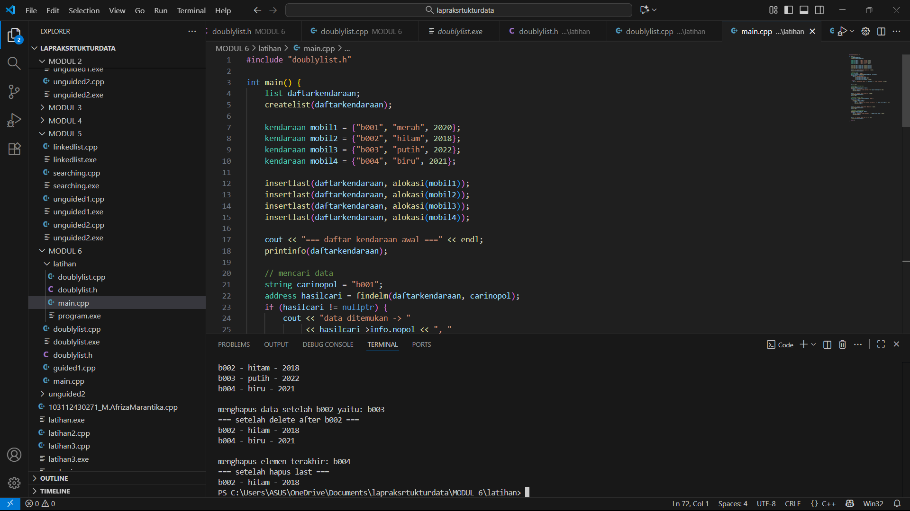

# M.AFRIZA-MARANTIKA-103112430271Modul6
LAPRAK MODUL 6

# <h1 align="center">Laporan Praktikum Modul 6 <br> Doubly Linked List (BAGIAN PERTAMA) </h1>
<p align="center">M.AFRIZA MARANTIKA - 103112430271</p>

## Dasar Teori

Doubly Linked List merupakan struktur data yang setiap elemennya saling terhubung dua arah melalui pointer next dan prev. Pointer next digunakan untuk menunjuk node berikutnya, sedangkan prev menunjuk node sebelumnya. Struktur ini memiliki dua penunjuk utama, yaitu first yang mengarah ke node pertama dan last yang mengarah ke node terakhir. Dengan adanya dua arah hubungan tersebut, Doubly Linked List memungkinkan proses traversal, penambahan, dan penghapusan data dilakukan dari dua arah dengan lebih fleksibel. Namun, struktur ini memerlukan memori lebih besar karena setiap node menyimpan dua pointer.
## Guided
### soal 1 
```c++
#include <iostream>
using namespace std;

struct Node {
    int data;
    Node* prev;
    Node* next;
};

Node* head = nullptr;
Node* tail = nullptr;

void insertDepan(int data) {
    Node* newNode = new Node();
    newNode->data = data;
    newNode->prev = nullptr;
    newNode->next = head;

    if (head != nullptr)
       head->prev = newNode;
    else
       tail = newNode;

    head = newNode;
    cout << "Data " << data << " berhasil ditambahkan di depan. \n";
}

void insertBelakang(int data) {
    Node* newNode = new Node();
    newNode->data = data;
    newNode->next = nullptr;
    newNode->prev = tail;

    if (tail != nullptr)
        tail->next = newNode;
    else
        head = newNode;

    tail = newNode;
    cout << "Data " << data << " berhasil ditambahkan di belakang.\n";
}

void insertSetelah(int target, int data) {
    Node* current = head;
    while (current != nullptr && current ->data != target)
        current = current->next;

    if(current == nullptr) {
        cout << "Data " << target << " tidak ditemukan.\n";
        return;
    }

    Node* newNode = new Node();
    newNode->data = data;
    newNode->next = current->next;
    newNode->prev = current;

    if (current->next != nullptr)
        current->next->prev = newNode;
    else
        tail = newNode;

    current->next = newNode;
    cout << "Data " << data << " berhasil disisipkan setelah " << target << ".\n";
}

void hapusDepan() {
    if (head == nullptr) {
        cout << "List kosong.\n";
        return;
    }

    Node* temp = head;
    head = head->next;

    if (head != nullptr)
        head->prev = nullptr;
    else
        tail = nullptr;

    cout << "Data " << temp->data << " dihapus dari depan.\n";
    delete temp;
}

void hapusBelakang() {
    if  (tail == nullptr) {
        cout << "List kosong.\n";
        return;
    }

    Node* temp = tail;
    tail = tail->prev;

    if (tail != nullptr)
        tail->next = nullptr;
    else
        head = nullptr;
    
    cout << "Data " << temp->data << " dihapus dari belakang.\n";
    delete temp;
}

void hapusData(int target) {
    Node* current = head;
    while (current != nullptr && current->data != target)
        current = current->next;

    if (current == nullptr) {
        cout << "Data " << target << " tidak ditemukan.\n";
        return;
    }

    if (current == head)
        hapusDepan();
    else if (current == tail)
        hapusBelakang();
    else {
        current->prev->next = current->next;
        current->next->prev = current->prev;
        cout << "Data " << target << " dihapus.\n";
        delete current;
    }
}
void updateData(int oldData, int newData) {
    Node* current = head;
    while (current != nullptr && current->data != oldData)
        current = current->next;

    if (current == nullptr) {
        cout << "Data " << oldData << " tidak ditemukan.\n";
        return;
    }

    current->data = newData;
    cout << "Data " << oldData << " diubah menjadi " << newData << ".\n";
}
void tampilDepan() {
    if (head == nullptr) {
        cout << "List kosong.\n";
        return;
    }

    cout << "Isi list (dari depan): ";
    Node* current = head;
    while (current != nullptr) {
        cout << current->data << " ";
        current = current->next;
    }
    cout << "\n";
}

// ====================================
// Fungsi: Tampilkan dari belakang
// ====================================
void tampilBelakang() {
    if (tail == nullptr) {
        cout << "List kosong.\n";
        return;
    }

    cout << "Isi list (dari belakang): ";
    Node* current = tail;
    while (current != nullptr) {
        cout << current->data << " ";
        current = current->prev;
    }
    cout << "\n";
}

// ====================================
// MAIN PROGRAM (MENU INTERAKTIF)
// ====================================
int main() {
    int pilihan, data, target, oldData, newData;

    do {
        cout << "\n===== MENU DOUBLE LINKED LIST =====\n";
        cout << "1. Insert Depan\n";
        cout << "2. Insert Belakang\n";
        cout << "3. Insert Setelah Data\n";
        cout << "4. Hapus Depan\n";
        cout << "5. Hapus Belakang\n";
        cout << "6. Hapus Data Tertentu\n";
        cout << "7. Update Data\n";
        cout << "8. Tampil dari Depan\n";
        cout << "9. Tampil dari Belakang\n";
        cout << "0. Keluar\n";
        cout << "===================================\n";
        cout << "Pilih menu: ";
        cin >> pilihan;

        switch (pilihan) {
            case 1:
                cout << "Masukkan data: ";
                cin >> data;
                insertDepan(data);
                break;
            case 2:
                cout << "Masukkan data: ";
                cin >> data;
                insertBelakang(data);
                break;
            case 3:
                cout << "Masukkan data target: ";
                cin >> target;
                cout << "Masukkan data baru: ";
                cin >> data;
                insertSetelah(target, data);
                break;
            case 4:
                hapusDepan();
                break;
            case 5:
                hapusBelakang();
                break;
            case 6:
                cout << "Masukkan data yang ingin dihapus: ";
                cin >> target;
                hapusData(target);
                break;
            case 7:
                cout << "Masukkan data lama: ";
                cin >> oldData;
                cout << "Masukkan data baru: ";
                cin >> newData;
                updateData(oldData, newData);
                break;
            case 8:
                tampilDepan();
                break;
            case 9:
                tampilBelakang();
                break;
            case 0:
                cout << "👋 Keluar dari program.\n";
                break;
            default:
                cout << "Pilihan tidak valid.\n";
        }

    } while (pilihan != 0);

    return 0;
}

```
Program diatas merupakan implementasi dari struktur data double linked list menggunakan bahasa c++ yang memungkinkan penyimpanan data secara dinamis dan dapat diakses dua arah program memiliki node yang berisi data pointer prev untuk menunjuk node sebelumnya dan next untuk menunjuk node berikutnya terdapat fungsi untuk menambah data di depan belakang dan setelah data tertentu serta fungsi untuk menghapus data baik di depan belakang maupun berdasarkan nilai tertentu selain itu ada juga fungsi update untuk mengubah nilai data dan dua fungsi tampil untuk menampilkan isi list dari depan maupun dari belakang program dilengkapi menu interaktif di fungsi main agar pengguna bisa memilih operasi yang diinginkan seperti menambah menghapus mengupdate dan menampilkan data secara langsung melalui input terminal


> Output


## Unguided

### Soal 1
Buatlah ADT Doubly Linked list sebagai berikut di dalam file “Doublylist.h”:

```go
Type infotype : kendaraan <
    nopol : string
    warna : string
    thnBuat : integer
>
Type address : pointer to ElmList
Type ElmList <
    info : infotype
    next : address
    prev : address
>

Type List <
    First : address
    Last : address
>

procedure CreateList( input/output L : List )
function alokasi( x : infotype ) → address
procedure dealokasi(input/output P : address )
procedure printInfo( input L : List )
procedure insertLast(input/output L : List,  
   input P : address )
```
Buatlah implementasi ADT Doubly Linked list pada file “Doublylist.cpp” dan coba hasil implementasi ADT pada file “main.cpp”.

> Contoh Output:
``` Output
masukkan nomor polisi: D001
masukkan warna kendaraan: hitam
masukkan tahun kendaraan: 90
masukkan nomor polisi: D003
masukkan warna kendaraan: putih
masukkan tahun kendaraan: 70
masukkan nomor polisi: D001
masukkan warna kendaraan: merah
masukkan tahun kendaraan: 80
nomor polisi sudah terdaftar
masukkan nomor polisi: D004
masukkan warna kendaraan: kuning
masukkan tahun kendaraan: 90
DATA LIST 1
no polisi : D004
warna     : kuning
tahun     : 90
no polisi : D003
warna     : putih
tahun     : 70
no polisi : D001
warna     : hitam
tahun     : 90
```

## doublylist.h
```go
#ifndef DOUBLYLIST_H
#define DOUBLYLIST_H

#include <iostream>
#include <string>
using namespace std;

struct kendaraan {
    string nopol;
    string warna;
    int thnbuat;
};

typedef kendaraan infotype;

struct elmList {
    infotype info;
    elmList *next;
    elmList *prev;
};

typedef elmList* address;

struct list {
    address first;
    address last;
};

// Deklarasi fungsi
void createlist(list &L);
address alokasi(infotype x);
void dealokasi(address &P);
void insertlast(list &L, address P);
void deletefirst(list &L, address &P);
void deletelast(list &L, address &P);
void deleteafter(address Prec, address &P);
address findelm(list L, string nopol);
void printinfo(list L);

#endif

```

## doublylist.cpp
```go
#include "doublylist.h"

void createlist(list &L) {
    L.first = nullptr;
    L.last = nullptr;
}

address alokasi(infotype x) {
    address P = new elmList;
    P->info = x;
    P->next = nullptr;
    P->prev = nullptr;
    return P;
}

void dealokasi(address &P) {
    delete P;
    P = nullptr;
}

void insertlast(list &L, address P) {
    if (L.first == nullptr) {
        L.first = P;
        L.last = P;
    } else {
        L.last->next = P;
        P->prev = L.last;
        L.last = P;
    }
}

void deletefirst(list &L, address &P) {
    if (L.first != nullptr) {
        P = L.first;
        L.first = L.first->next;
        if (L.first != nullptr) {
            L.first->prev = nullptr;
        } else {
            L.last = nullptr;
        }
    }
}

void deletelast(list &L, address &P) {
    if (L.last != nullptr) {
        P = L.last;
        L.last = L.last->prev;
        if (L.last != nullptr) {
            L.last->next = nullptr;
        } else {
            L.first = nullptr;
        }
    }
}

void deleteafter(address Prec, address &P) {
    if (Prec != nullptr && Prec->next != nullptr) {
        P = Prec->next;
        Prec->next = P->next;
        if (P->next != nullptr) {
            P->next->prev = Prec;
        }
    }
}

address findelm(list L, string nopol) {
    address P = L.first;
    while (P != nullptr) {
        if (P->info.nopol == nopol) {
            return P;
        }
        P = P->next;
    }
    return nullptr;
}

void printinfo(list L) {
    address P = L.first;
    while (P != nullptr) {
        cout << P->info.nopol << " - "
             << P->info.warna << " - "
             << P->info.thnbuat << endl;
        P = P->next;
    }
}

```

## main.cpp
```go
#include "doublylist.h"

int main() {
    list daftarkendaraan;
    createlist(daftarkendaraan);

    kendaraan mobil1 = {"b001", "merah", 2020};
    kendaraan mobil2 = {"b002", "hitam", 2018};
    kendaraan mobil3 = {"b003", "putih", 2022};
    kendaraan mobil4 = {"b004", "biru", 2021};

    insertlast(daftarkendaraan, alokasi(mobil1));
    insertlast(daftarkendaraan, alokasi(mobil2));
    insertlast(daftarkendaraan, alokasi(mobil3));
    insertlast(daftarkendaraan, alokasi(mobil4));

    cout << "=== daftar kendaraan awal ===" << endl;
    printinfo(daftarkendaraan);

    // mencari data
    string carinopol = "b001";
    address hasilcari = findelm(daftarkendaraan, carinopol);
    if (hasilcari != nullptr) {
        cout << "data ditemukan -> "
             << hasilcari->info.nopol << ", "
             << hasilcari->info.warna << ", "
             << hasilcari->info.thnbuat << endl;
    } else {
        cout << "data dengan nopol " << carinopol << " tidak ditemukan" << endl;
    }

    cout << endl;

    // menghapus elemen pertama
    address hapus;
    deletefirst(daftarkendaraan, hapus);
    if (hapus != nullptr) {
        cout << "menghapus elemen pertama: " << hapus->info.nopol << endl;
        dealokasi(hapus);
    }

    cout << "=== setelah hapus first ===" << endl;
    printinfo(daftarkendaraan);
    cout << endl;

    // menghapus setelah b002
    address prec = findelm(daftarkendaraan, "b002");
    if (prec != nullptr) {
        deleteafter(prec, hapus);
        if (hapus != nullptr) {
            cout << "menghapus data setelah b002 yaitu: " << hapus->info.nopol << endl;
            dealokasi(hapus);
        }
    }

    cout << "=== setelah delete after b002 ===" << endl;
    printinfo(daftarkendaraan);
    cout << endl;

    // menghapus elemen terakhir
    deletelast(daftarkendaraan, hapus);
    if (hapus != nullptr) {
        cout << "menghapus elemen terakhir: " << hapus->info.nopol << endl;
        dealokasi(hapus);
    }

    cout << "=== setelah hapus last ===" << endl;
    printinfo(daftarkendaraan);

    return 0;
}

```

> Output
> 
Program diatas menggunakan struktur data doubly linked list untuk menyimpan data kendaraan setiap kendaraan memiliki nomor polisi warna dan tahun pembuatan program diawali dengan membuat list kosong kemudian membuat beberapa data kendaraan baru yang dimasukkan ke dalam list menggunakan fungsi insertlast setelah semua data masuk program menampilkan isi list lalu mencari data berdasarkan nomor polisi dengan fungsi findelm jika ditemukan akan menampilkan data kendaraan tersebut kemudian program menghapus elemen pertama dengan fungsi deletefirst dan menampilkan hasilnya kembali semua operasi seperti alokasi dealokasi insert delete dan pencarian dilakukan dengan manipulasi pointer next dan prev agar data dapat diakses dua arah dari depan maupun belakang

## Referensi

1. https://en.wikipedia.org/wiki/Data_structure
